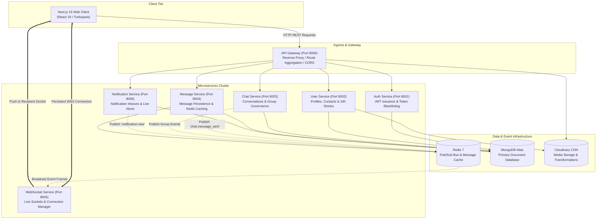
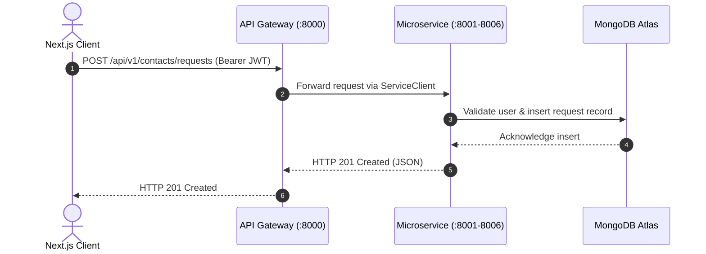
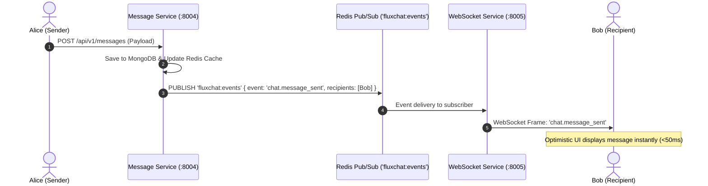

# FluxChat — Project Overview & High-Level Design (HLD)

---

## 1. Executive Summary & Project Idea

### 1.1 The Problem Statement
Real-time messaging applications operate under rigorous operational constraints. In traditional monolithic architectures, long-lived client connections (such as WebSockets) compete for resources with CPU-intensive operations (such as media compression, authentication hashing, and complex database analytics). 

When traffic spikes:
- **Connection Saturation**: Monolithic servers run out of file descriptors and socket pools.
- **Cascading Failures**: A bottleneck in status stories or media processing can freeze the entire real-time message delivery pipeline.
- **Tight Coupling**: Database writes directly in the socket request loop cause message latency spikes exceeding 500ms.

### 1.2 The Project Idea
**FluxChat** is an event-driven, microservices-based real-time communication platform designed from the ground up to solve these architectural bottlenecks. 

By decomposing the platform into dedicated, independently scalable microservices and utilizing an asynchronous message bus (Redis Pub/Sub), FluxChat isolates real-time socket connections from transactional database persistence.

```
+---------------------------------------------------------------------------------------+
|                                     FluxChat Idea                                     |
|                                                                                       |
|   "Deliver sub-50ms instant messaging, rich multimedia stories, and fine-grained      |
|    group privacy policies through an independently scalable microservices cluster."   |
+---------------------------------------------------------------------------------------+
```

### 1.3 Key Architectural Highlights
- **Sub-50ms Message Delivery**: Direct socket delivery via Redis Pub/Sub backplane with optimistic UI updates on the client.
- **Two-Tier Storage**: Redis in-memory caching for active message history coupled with MongoDB Atlas for durable document persistence.
- **Complete Media Lifecycle**: Fully integrated Cloudinary CDN pipeline for profile avatars, covers, chat attachments, and 24-hour status stories.
- **Enterprise Group Governance**: Founding admin privileges, flexible join policies (`open` vs. `approval`), and real-time membership management.
- **Real-Time Request & Notification Subsystem**: Live in-app toast banners and persistent notification inbox for contact requests, group join requests, and administrative approvals.
- **Unlimited Profile Links**: Customizable web & social links for developer and professional portfolios.

---

## 2. Requirements Specification

### 2.1 Functional Requirements

| Capability | Detailed Requirement |
|---|---|
| **Identity & Access** | User registration, login with JWT (access + refresh token rotation), password hashing via Argon2/Bcrypt, token revocation/blacklisting. |
| **Direct 1:1 Messaging** | Real-time bidirectional text and attachment messaging, delivery/read receipts, typing indicators, and emoji reactions. |
| **Group Collaboration** | Group creation, member roster, role elevation (Admins), and join mode settings (`open` vs. `approval`). |
| **24-Hour Status Stories** | Photo and styled text stories with automatic 24-hour time-to-live (TTL) expiration, restricted strictly to confirmed contacts. |
| **Connection Requests** | Bilateral contact discovery, sending/accepting/rejecting requests with automatic roster synchronization. |
| **Notifications & Alerts** | In-app floating toast alerts and persistent notification inbox for connection requests, approvals, and group events. |
| **Profile Customization** | Cloudinary avatars and cover images, personal bio, phone, and unlimited custom web/social links (GitHub, LinkedIn, Portfolio, etc.). |
| **Permanent Data Deletion** | Permanent message purge on conversation delete, leaving zero orphaned documents. |

### 2.2 Non-Functional Requirements

- **Latency**: Sub-50ms end-to-end WebSocket message delivery under typical network conditions.
- **Scalability**: Stateless microservices capable of horizontal scaling behind a reverse proxy or cloud load balancer.
- **Availability & Resilience**: Fault-tolerant design where failure in secondary services (e.g., Notification or Status) does not impede active chat messaging.
- **Security**: Strict JWT authorization on all private endpoints, sanitized user inputs to prevent injection, CORS enforcement, and secure Cloudinary signed uploads.
- **Clean Architecture**: Clear separation of concerns (Routers -> Services -> Repositories -> Data Stores).

---

## 3. High-Level Architecture (HLD)

### 3.1 System Topology Diagram



---

## 4. Microservice Decomposition & Domain Boundaries

```
+-------------------------------------------------------------------------------------------+
|                                    MICROSERVICES DOMAINS                                  |
+-------------------+------+----------------------------------------------------------------+
| Service Name      | Port | Domain Responsibilities                                        |
+-------------------+------+----------------------------------------------------------------+
| api-gateway       | 8000 | Reverse proxy, route dispatching, CORS handling, media upload  |
| auth-service      | 8001 | User credential verification, JWT issuance, token revocation   |
| user-service      | 8002 | Profiles, contact rosters, requests, 24h status stories        |
| chat-service      | 8003 | 1:1 and group conversations, admin controls, join permissions  |
| message-service   | 8004 | Message history, Redis caching, reactions, read receipts       |
| websocket-service | 8005 | Active socket connection management, heartbeat, Redis listener |
| notification-service 8006 | Persistent notification inbox, live alert dispatching         |
+-------------------+------+----------------------------------------------------------------+
```

### 4.1 API Gateway (`:8000`)
- **Single Entry Point**: Shields downstream microservices from direct public exposure.
- **Route Dispatching**: Proxies incoming REST traffic to corresponding services using resilient asynchronous HTTP clients.
- **Central Media Ingress**: Provides direct multipart file upload endpoints routing to Cloudinary.

### 4.2 Auth Service (`:8001`)
- **Authentication**: Issues cryptographically signed JSON Web Tokens (Access Tokens: 15-minute TTL, Refresh Tokens: 7-day TTL).
- **Session Revocation**: Maintains a high-speed token revocation blacklist in MongoDB with automatic TTL expiration.

### 4.3 User Service (`:8002`)
- **Profile Management**: Manages full user profiles, avatars, cover banners, and unlimited social/web links.
- **Contact Management**: Bilateral connection requests, acceptance/rejection lifecycle, and confirmed contact rosters.
- **24-Hour Status Stories**: Ephemeral photo and styled text stories with automated 24-hour TTL expiration and contact-only privacy enforcement.

### 4.4 Chat Service (`:8003`)
- **Conversations**: Virtual and canonical 1:1 direct messaging threads.
- **Group Governance**: Creation of groups, admin permissions, member promotions/removals.
- **Join Policies**: Support for `open` groups (instant join) versus `approval` groups (pending join requests with admin approval workflows).
- **Permanent Purge**: Complete conversational purge removing all records across services on deletion.

### 4.5 Message Service (`:8004`)
- **Message Pipeline**: Message storage, rich attachments, emoji reactions, and read receipts.
- **Redis Caching**: Caches recent conversation history in Redis (`cache:messages:{convId}:{limit}`) for instant zero-latency retrieval.
- **Event Publishing**: Dispatches `chat.message_sent` and `messages.read` events to the Redis message bus.

### 4.6 WebSocket Service (`:8005`)
- **Connection Management**: Maintains persistent full-duplex WebSocket connections mapped to active user IDs.
- **Redis Event Listener**: Subscribes to `fluxchat:events` on Redis and routes real-time frames directly to the intended recipient sockets.
- **Heartbeat Probes**: Handles periodic ping-pong keepalives to detect dropped connections.

### 4.7 Notification Service (`:8006`)
- **Persistent Inbox**: Stores user notifications (requests, system alerts, approvals) in MongoDB.
- **Real-Time Dispatching**: Publishes `notification.new` frames to Redis so users receive instant interactive floating toast banners.

---

## 5. Network Data Flows & Communication Patterns

### 5.1 Synchronous REST Communication (Command Pattern)
Clients issue HTTP requests to the API Gateway using standard REST verbs. The Gateway translates the request and communicates with the backend microservice via an asynchronous HTTP client pool:



### 5.2 Asynchronous Real-Time Event Pipeline (Pub/Sub Pattern)
When a state change occurs (such as a new message or connection request), the originating service publishes an event to Redis. The WebSocket service receives it and forwards it across active client sockets:



---

## 6. Technology Stack & Tradeoff Analysis

```
+-------------------------------------------------------------------------------------------+
|                                    TECHNOLOGY MATRIX                                      |
+--------------------+-------------------------+--------------------------------------------+
| Layer              | Technology              | Architectural Rationale                    |
+--------------------+-------------------------+--------------------------------------------+
| Frontend Framework | Next.js 16 (App Router) | Server-side rendering, Turbopack, React 19 |
| Styling            | Vanilla CSS + Tailwind  | Custom design system, zero runtime penalty |
| Backend Services   | Python 3.14 + FastAPI   | High-performance async/await, OpenAPI docs |
| Primary Database   | MongoDB Atlas (Motor)   | Flexible document model, JSON-native       |
| In-Memory Cache    | Redis 7                 | Sub-millisecond read cache & Pub/Sub bus   |
| Media Engine       | Cloudinary CDN          | Global CDN, responsive image transforms    |
| Containerization   | Docker & Compose        | Reproducible isolated local & prod setups  |
+--------------------+-------------------------+--------------------------------------------+
```

### 6.1 Architectural Tradeoffs

#### Tradeoff 1: Microservices vs. Monolith
- **Decision**: Decomposed architecture with 7 purpose-built services.
- **Tradeoff**: Introduces inter-service networking, but completely prevents connection saturation from blocking business transactions. Socket workers run independently from compute-heavy media and database jobs.

#### Tradeoff 2: MongoDB Document Store vs. Relational SQL
- **Decision**: MongoDB Atlas for user, conversation, and message storage.
- **Tradeoff**: While relational databases enforce strict foreign keys, chat applications deal with polymorphous payloads (text, attachments, stickers, reactions, status slides). MongoDB's BSON document model naturally matches JSON chat objects without expensive SQL joins.

#### Tradeoff 3: Redis Pub/Sub vs. Heavy Message Brokers (Kafka / RabbitMQ)
- **Decision**: Redis Pub/Sub for the real-time event pipeline.
- **Tradeoff**: Kafka offers durable partition replay, but introduces significant operational overhead. For real-time socket routing where MongoDB already provides durable message persistence, Redis delivers lightweight in-memory dispatching with negligible latency (<2ms).

---

## 7. Security & Resilience Architecture

1. **Defense in Depth**:
   - Authentication tokens are validated cryptographically on every protected route.
   - Passwords are never stored in plaintext; they are hashed with modern salted Argon2/Bcrypt.
   - Revoked tokens are immediately written to the revocation list, preventing replay attacks.
2. **Resilient Inter-Service HTTP Client (`ServiceClient`)**:
   - Connection pooling (up to 100 concurrent sockets).
   - Exponential backoff retries on transient network disconnects.
   - Standardized error translation mapping upstream HTTP errors to domain exceptions.
3. **Graceful Degradation**:
   - If Redis becomes temporarily unreachable, services fall back to direct database reads.
   - If Cloudinary credentials are omitted in development, services fall back to responsive data URI processing without crashing.

---

## 8. Summary
FluxChat combines the throughput of async microservices, the speed of Redis in-memory pub/sub, and the flexibility of MongoDB to provide an enterprise-grade chat experience capable of supporting instant messaging, group governance, media stories, and real-time alerts.
